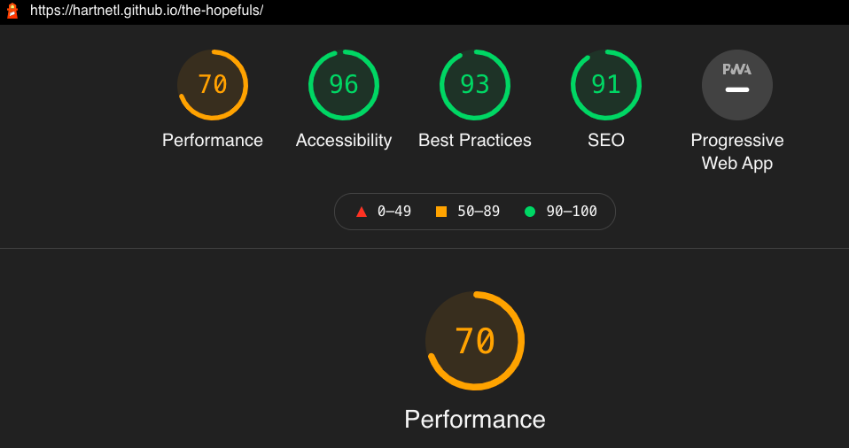

# A Scare At Bedtime

  

Play it [here](https://hartnetl.github.io/the-hopefuls/)

## Introduction

Welcome to our spookathon interactive, animated halloween book.  The book where **you** get to choose where the story takes you. Choose from an adult or children's story. The adults will take you on a trip around a spooky island, or the children's will spook your mind with a spooky doll, each page you will be presented with options, which path will you follow or will you be *scared* and want to return to the start. 

## Features

- **Navigation Bar**
    
    - Each page allows you to return to the home page via the name of the game.
    - If you *dare* to click it each page has a how to play button.

- **Interactive**
    
    - Choose from either an Adults or Children's story.
    - Each story page has two choices as to where the story goes.

- **Animated**
    
    - Buttons pop out, spiders crawl and ghosties float around. Text is animated to type.  
    

- **Spooky**
    
    - Each button throughout the site has different spooky noises attched to them.

## Technologies Used

- HTML
- CSS
- Javascript

## Testing
- [HTML Validator](https://validator.w3.org/)
    - Errors were found and resolved. Several warnings
- [CSS Validator](https://jigsaw.w3.org/css-validator/)
    - No errors found.
- [JSHint](https://jshint.com/)
    - No errors found. Several warnings.
- Lighthouse: 
    

### Validator Testing
### Unfixed Bugs
-  Warnings on HTML Validator.
- Warnings on JSHint Validator.

## Deployment

- The site has been deployed through GitHub pages.
    - In the GitHub repository navigate to settings.
    - From the source section drop-down menu, select the Master Branch.
    - Once the master branch has been selected, the page will be automatically refreshed with a detailed ribbon display to indicate the successful deployment.

The live link can be found here: <https://hartnetl.github.io/the-hopefuls/>

## Screenshots

Wireframes

Homepage

Game

## Credits
- Audios:
    - [FreeSound](https://freesound.org): 
        - 'screamofsouls.wav' by 'univ_lyon3'.
        - 'kid.mp3' by 'Thegamemakerqueen'.
        - 'scream.wav' by 'kokopetiyot'.

- Images:
    - [Flaticon](https://www.flaticon.com/):
        - Ghost icon 
Icons made by <a href="" title="wanicon">wanicon</a> from <a href="https://www.flaticon.com/" title="Flaticon">www.flaticon.com</a>

    - Banner ghost from [adobe stock images](https://stock.adobe.com/sk/search?k=ghost&asset_id=175077463)
    - Logo created with [designevo](https://www.designevo.com/)
    - [The spike island image](http://homepage.eircom.net/~corkcounty/images/spike4.jpg)
    - [Shadow of a men in forest](https://res.cloudinary.com/jerrick/image/upload/v1552500006/n4xss7blhhsg2bd9mgtf.jpg)
    - All the other images are from [Unsplash](https://unsplash.com) and [Pexels](https://www.pexels.com)

- Fonts used are from [Google Fonts](https://fonts.google.com)